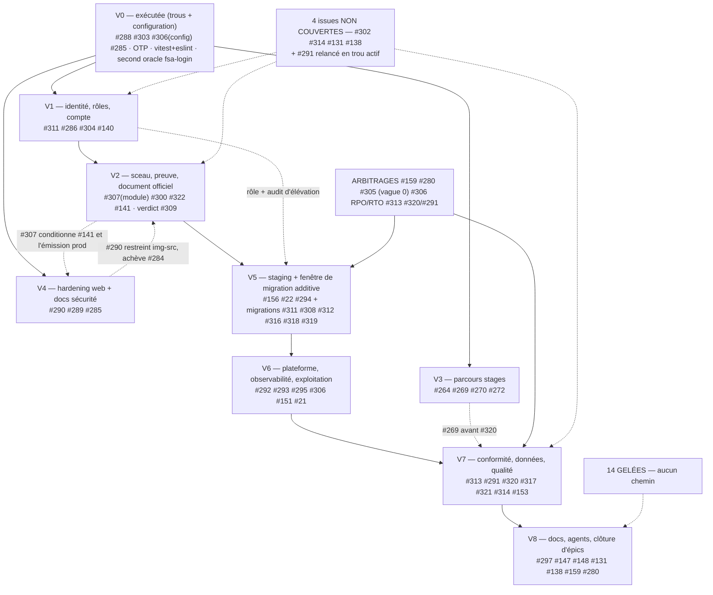

# ROADMAP — Fermeture des 90 issues ouvertes (FSA Attestations)

## En-tête

| Champ | Valeur |
|---|---|
| Périmètre | Les **90 issues ouvertes** (89 issues + l'épique de pilotage #323) |
| Source des statuts | Réconciliation vérifiée sur la branche **`sec/vague-a-p0`** — `npx vitest run` = **1455 tests / 138 fichiers, 100 % vert** (~66 s), preuves `chemin:ligne` dans le code |
| Ordre d'exécution | Ordre imposé par #323 : (1) P0 sécurité & preuve officielle #264, #265, #281–#307 · (2) P0 identité/compte/exploitation #303–#307 · (3) P1 parcours stages & conformité #266–#272 · (4) P1 plateforme & résilience #292, #293, #295, #310–#317 · (5) P2 robustesse/docs/données #291, #297, #318–#322 |
| Règles #323 | Une issue ne se ferme qu'après **tests + critère de sortie vérifié + preuve documentée** · aucun correctif P0 ne dépend d'un P2 · changements de schéma **additifs et non destructifs** · **codes FSA, PDF officiels et audits historiques préservés** |

> **La v1 de cette roadmap est périmée** sur #11, #12, #13, #139, #266, #267, #268, #282, #284, #304 : la réconciliation établit qu'ils sont **DÉJÀ FAIT** (tests et code dans le dépôt), alors que la v1 les classait « à écrire » ou « à traiter ». **Ce document fait foi sur ce point.**

**Ce que la réconciliation change structurellement** : les vagues 1 et 2 de la v1 (P0 config #281–#284, identité #303/#304) sont **déjà livrées et testées** ; le risque n'est plus « écrire » mais « activer et prouver ». Le goulot n°1 devient **#156 staging absent**, qui bloque six migrations additives faute de fenêtre de test. La profondeur critique tombe de **6 vagues enchaînées à 4**.

---

## Vague 0 — exécutée (livré, avec preuves)

> Cette vague a été **exécutée** sur `sec/vague-a-p0`. Chaque ligne porte sa preuve `chemin:ligne` et son fichier de test. Base de mesure : `npx vitest run` = **1455 tests / 138 fichiers, 100 % vert** (~66 s) · couverture statements **74,07 %** · branches **70,54 %** · functions **79,70 %** · lines **75,16 %** → **le ratchet tient sans re-calibration** (seuils 59/53/63/60, marge ~15 points).

| Item | Livré | Preuve | Couverture |
|---|---|---|---|
| **#288** | Garde `getSealSecret()` + rejet dur **503** sur les 2 voies qui créaient une attestation non scellée **en silence** ; **aucune écriture en base** | `app/api/attestations/route.ts:120-130,197-207`, `lib/stage-attestation/issue.ts:284-303,334-341` | `tests/api/attestation-seal-required.test.ts` (11 tests), dont **garde statique** interdisant le retour du motif `...(seal ? {` |
| **#303** | Quota **fail-closed** sur `claimCode` (10/15 min, IP + utilisateur) ; `endsWith` supprimé au profit d'une **égalité stricte** ; réponses **indifférenciées** | `app/api/user/claim-code/route.ts`, `lib/rate-limit.ts:320-333,413,447-448` | `tests/api/user-claim-code.test.ts` (23 tests) |
| **Second oracle** (trouvé en cours de route, puis corrigé) | `app/api/auth/fsa-login/route.ts` faisait `endsWith: -${code}` et ses quotas étaient **fail-open** → passés **fail-closed**, recherche stricte, réponses indifférenciées ; le secret ne part plus **en clair** dans une clé Redis (**condensat**). Le « hash final » de la documentation n'était pas un second mode d'authentification mais **le fragment lui-même** | `app/api/auth/fsa-login/route.ts` | `tests/api/fsa-login.test.ts` (**40 tests, contre 14**) |
| **#306** | Offsite **fail-closed en production** : sous `NODE_ENV=production`, sortie non nulle si `BACKUP_REMOTE`, `rclone`, `age` ou `BACKUP_AGE_RECIPIENT` manque ; un envoi **non chiffré** ne peut plus partir en prod ; l'échec d'upload se propage. `.env.example` : **7 variables** marquées obligatoires selon la convention existante. Procédure et emplacements RPO/RTO **« À ARBITRER »** dans `docs/ops/procedures.md` § 5.5 | `scripts/vps-pre-deploy-backup.sh`, `.env.example` | — |
| **Fuite OTP** | 2 `console.log` d'OTP **en clair** corrigés ; le code ne s'affiche plus en production | `lib/email.ts` | `tests/lib/email-otp-logging.test.ts` (16 tests) |
| **#285** | Page cookies et `docs/SECURITY_FIX_GUIDE.md` alignés sur le **contrôle d'origine réel** (`trustedOrigins` + `SameSite=Lax`) ; la page ne promet **plus de jeton** | `app/(public)/legal/cookies/page.tsx`, `docs/SECURITY_FIX_GUIDE.md` | — |
| **#321** (livré sur son volet immédiat) | 7 routes passées de `error.message` brut à `handleApiError` ; les 20 occurrences du `grep` ramenées à **10**, dont **3 messages métier** volontairement conservés | 7 routes API de `app/api/` | `tests/lib/error-disclosure.test.ts` (7 tests) prouvant qu'**aucun détail Prisma ne sort en production** |
| **#315** | Quota posé ; `pending` et `totalUsers` **supprimés de la base** (les `COUNT` sont retirés) ; agrégat `progressRatio` ; `dynamic` au lieu de `revalidate` — sans quoi le quota ne s'appliquait pas | `app/api/public/stats/route.ts` | `tests/api/public-stats.test.ts` (16 tests) |
| **#84** | `app/admin/error.tsx`, `app/global-error.tsx`, `app/admin/loading.tsx` créés ; le dashboard **tolère la perte d'un compteur** au lieu de tomber | `app/admin/error.tsx`, `app/admin/loading.tsx`, `app/global-error.tsx` | — |
| **Outillage** | Worktrees exclus de **vitest** (collecte **et** `coverage.exclude`) et d'**eslint** | `vitest.config.ts:22-26,44-65`, `eslint.config.mjs:24-25` | `eslint .` = **18 s, 0 erreur** (l'ignore de `.worktrees/**` corrigeait un `eslint .` qui **n'aboutissait jamais** en local : 22 worktrees parcourus) |

---

## Tableau maître de statut des 90 issues

Légende : **FAIT** (code + tests dans le dépôt) · **PARTIEL** (reliquat réel identifié) · **ABSENT** (rien à écrire) · **NC** (non couvert par la réconciliation, verdict à établir en vague 0) · **GELÉE** · **FERMER** · **ARBITRAGE**.

### A. Sécurité applicative & configuration (11)

| # | Verdict | Reliquat en une ligne |
|---|---|---|
| 281 | **FAIT** | Whitelist stricte **sans spread** sur `app/api/verifier/route.ts` ; `tests/api/verifier-public-whitelist.test.ts` (12 tests) ; **reliquat traité depuis** : le `id` (cuid interne) retiré de la réponse publique, empreinte `FP:` rattachée au `code` FSA |
| 282 | **FAIT** | `lib/auth.ts:30-34` throw au chargement si `NODE_ENV=production` sans secret ; à confirmer que le build Next n'évalue pas ce throw au build-time |
| 283 | **FAIT** | Résolution + **throw au démarrage** sur origine `http://` en production (`lib/auth.ts`) ; `tests/security/trusted-origins.test.ts` (18 tests) ; **reliquat traité depuis** : l'origine en clair retirée de l'allowlist de production |
| 284 | **FAIT** | `next.config.mjs:51-77` + `tests/config/next-image-remote-patterns.test.ts` ; reliquat `img-src` **résorbé** : CSP statique retirée de `next.config.mjs:112-131`, gérée dynamiquement dans `proxy.ts:88-95` (nonce par requête, `img-src 'self' data: blob:`, `connect-src` restreint, `d40a77e`) |
| 285 | **FAIT** | Page cookies et `docs/SECURITY_FIX_GUIDE.md` **alignés sur le contrôle d'origine réel** (`trustedOrigins` + `SameSite=Lax`) ; la page ne promet plus de jeton. Le reliquat documentaire est résorbé ; il ne reste que la refonte CSP #290 (vague 4) |
| 287 | **FAIT (P0)** | Quotas, identité XFF, quota d'octets ; reliquat : pas de dimension « device », `getClientIdentity` ne lit que `x-forwarded-for` |
| 288 | **FAIT** | Garde `getSealSecret()` + rejet dur **503** sur les 2 voies qui contournaient le sceau, **aucune écriture en base** : `app/api/attestations/route.ts:120-130,197-207`, `lib/stage-attestation/issue.ts:284-303,334-341` ; `tests/api/attestation-seal-required.test.ts` (11 tests) |
| 289 | PARTIEL | 7 exports orphelins de `lib/sanitization.ts`, 0 appel applicatif ; risque réel = champs riches (`InternshipRequest.observations`) sans allowlist HTML, aucun DOMPurify |
| 290 | **FAIT (code)** | Nonce par requête (`proxy.ts:88-95`, `x-nonce` aux Server Components `:129-131`) : `script-src 'self' 'nonce-…' 'strict-dynamic'`, `img-src 'self' data: blob:`, `connect-src` restreint (Resend + Upstash), CSP statique retirée de `next.config.mjs:112-131` ; livré par `d40a77e`. Assumé : `style-src 'unsafe-inline'` conservé (Tailwind/CSS-in-JS) |
| 303 | **FAIT** | Quota **fail-closed** sur `claimCode` (10/15 min, IP + utilisateur, `lib/rate-limit.ts:320-333,413,447-448`) ; `endsWith` supprimé au profit d'une **égalité stricte** (plus de recherche sur ≤ 5 hex) ; réponses indifférenciées ; `tests/api/user-claim-code.test.ts` (23 tests) |
| 310 | **FAIT (P0)** | Fail-closed `:417,434,632` → 503, quota distribué Upstash ; reliquat : store mémoire sans purge planifiée (→ #320) |

### B. Identité, rôles et compte (3)

| # | Verdict | Reliquat en une ligne |
|---|---|---|
| 286 | PARTIEL | `role String @default("user")` (`prisma/schema.prisma:65`), comparaison `role !== "admin"` (`lib/api-auth.ts:95-104`) ; pas de `model Role`/`Permission` ; **dépend de #311** |
| 304 | **FAIT** | `lib/account-status.ts:212` révoque les sessions, propagation `banned`/`banExpires`, audit, 2 fichiers de tests ; reliquat : `ACCOUNT_SUSPENDED` purgé paresseusement (`:249`), `ACCOUNT_UNBLOCKED` audité seulement si `data.status` est fourni, aucun test de désynchronisation `banned` ↔ `status` |
| 311 | PARTIEL | **Deux sources** : `User.role` en DB et `ADMIN_USER_IDS` (`lib/auth.ts:297-301`) ; **audit d'élévation absent** : `USER_RETROGRADED` déclaré `lib/audit.ts:25` mais 0 usage, `USER_MANAGEMENT` jamais émis |

### C. Attestations & preuve officielle (11)

| # | Verdict | Reliquat en une ligne |
|---|---|---|
| 9 | **FERMER** | Résiduel couvert par #307 (module) + #308 (clé) + #141 (tests) |
| 141 | PARTIEL | Flux couvert (`parcours-candidat.e2e.ts:167-179`, `verification-publique.e2e.ts`, `pdf.test.ts`) ; module #307 désormais livré (vague infra) → **reste l'E2E sur le PDF officiel réel et son QR gravé** |
| 299 | **FAIT** | `app/api/attestations/[id]/route.ts:330-438` + `lib/attestations/lifecycle.ts:108-127` + migration `20260929` — soft delete et révocation matérialisés |
| 300 | **FAIT** | Sceau v2 appliqué sur **toutes** les voies : `app/api/attestations/route.ts:278,291-293` + `lib/stage-attestation/issue.ts:319,351-353` (`sealVersion: 2`) ; livré par `aba91c6` |
| 301 | **FAIT** | `app/api/admin/attestations/[id]/actions/route.ts:90-183` + `lib/attestations/lifecycle.ts:161-189` ; verrou par `tests/lib/attestations/legacy-corpus-40.test.ts` |
| 302 | **FAIT** | `lib/attestations/issue.ts:156` — un document officiel ne porte plus de PII fictives (émission refusée si nom/naissance manquants) ; livré par `6e343d3` |
| 307 | **FAIT (code) — action humaine restante : preuve d'émission en prod** | Module versionné dans le dépôt `lib/attestations/pdf-generator/index.ts` (246 L, QR vers `/verifier?code=…`, `f73f3b4`) et **câblé** : `compose.prod.yml:63`, `.env.production:74,80`, `.env.example:157` → `OfficialPdfUnavailableError` ne peut plus survenir à config déployée. **Reste** : constater une émission `CERTIFICATION` réussie sur la prod déployée |
| 308 | **ABSENT** | Aucun `sealKeyId`/`SigningKey` (grep = 0) ; `tests/api/ready.test.ts:64-69` prouve qu'une rotation invalide tous les sceaux ; **migration additive** |
| 309 | PARTIEL | Enum `REJECTED`/`REVOKED` distincts, champs + migration `20260929` ; manque registre public des révocations, horodatage/motif dans la réponse publique, origine REJECTED-pose vs REVOKED-cycle ; colonne `ATTESTATION_REJECTED` (`:612`) inutilisée — à confirmer |
| 316 | **FAIT** | Séquence PG `attestation_code_seq` (`prisma/migrations/202609280_attestation_code_sequence/migration.sql:6`) consommée par `nextval()` atomique sur les 2 voies d'émission (`lib/attestations/issue.ts:243-247`, `app/api/attestations/route.ts:219-223`) → plus de P2002 en concurrence ; livré par `6e343d3` + `aba91c6` |
| 322 | **FAIT** | Invariants par type refusés en 400 : `CERTIFICATION` ⇒ score + mention + heures, `STAGE` ⇒ heures, champ non persisté `certificationHoursExempted` rejeté (`app/api/attestations/route.ts:119-147`) ; unicité sous concurrence couverte par la séquence #316 ; livré par `5817a3d` |

### D. Stages & parcours candidat (8)

| # | Verdict | Reliquat en une ligne |
|---|---|---|
| 264 | **FAIT (code) — action humaine restante : migration des `cvUrl` existants à confirmer en base** | Voie authentifiée restreinte au HTTPS (`app/api/user/internships/route.ts:13-17` refuse `javascript:`, `file:`, `data:`) + `sanitizeInput` sur tous les champs (`:134-138`) ; livré par `6e343d3` + `aba91c6` |
| 265 | **FAIT** | `lib/stage-attestation/issue.ts:28,30,219-253,347-380` (#266/#267 déjà FAIT) |
| 266 | **FAIT** | `lib/internships/{schemas,state-machine,mutation,audit-actions}.ts` testés ; rien |
| 267 | **FAIT** | Transitions `:31,37,40,42` (`ARCHIVED` terminal), `:74` validation, `:120 allowedNext` ; rien |
| 268 | **FAIT** | `app/api/public/internships/route.ts:17` email obligatoire → plus d'anonyme sans canal, `:133` confirmation, `:136-141` notif admins ; reste : aucun email au candidat à l'acceptation/refus (`app/api/admin/internships/route.ts:86` n'audite que) |
| 269 | **FAIT (code)** | `StoredObject.retentionUntil` (365 j) désormais **honorée** par un job idempotent `lib/jobs/retention-purge.ts:89-96` (objets échus non officiels : octets + ligne supprimés, `AuditLog` `RETENTION_PURGED`, `isOfficialStoredObject` protège les PDF officiels), exposé via `POST /api/internal/retention/purge/route.ts:18-19` (`CRON_SECRET`, GET 405) ; politique `docs/legal/retention-policy.md` ; livré par `1bfab89`. Reliquat → quotas par compte (#320, vague 7) |
| 270 | PARTIEL | Compteur + `stageScore` livrés côté UI (`app/admin/internships/page.tsx:71,133-135`) et API (`aba91c6`) ; reste la cohérence UI/API fine détaillée dans l'issue |
| 272 | **FAIT (code) — action humaine restante : vert en CI** | Specs Playwright : `e2e/parcours-stage.e2e.ts` (230 L : dépôt public → décision admin → export → sentinelle d'émission) + `e2e/parcours-admin.e2e.ts` (211 L) ; livré par `281c900`. Reste : passage vert dans le job E2E |

### E. Plateforme, ops, données & conformité (20)

| # | Verdict | Reliquat en une ligne |
|---|---|---|
| 21 | **FAIT (code) — action humaine restante : rotation documentée** | `.env.production` injecté via le flux SSH chiffré, plus de SCP en clair (`scripts/deploy-to-vps.sh:146-148`, `scripts/check-env-files.sh`) ; livré par `8d8023c`. Reste : procédure + calendrier de rotation des secrets |
| 22 | **FAIT (code) — action humaine restante : exécution du rollback à vérifier hors prod** | Staging isolé (`compose.staging.yml` : Postgres dédié `:92-103`, secrets distincts, healthcheck `/api/ready` `:67-71`), images GHCR taguées par SHA (`compose.prod.yml:10`, jobs `build-and-push`/`deploy-staging`/`deploy-prod`/`rollback` `.github/workflows/deploy.yml:49-320`, staging bloque la prod `:176-180`) ; livré par `ebeea12` |
| 153 | **FAIT (code) — action humaine restante : registre des traitements + consentements tracés (aucune issue ouverte, à trancher)** | Purge RGPD livrée : job idempotent `lib/jobs/retention-purge.ts` + `POST /api/internal/retention/purge` (`CRON_SECRET`, GET 405) + politique `docs/legal/retention-policy.md` + `tests/lib/retention-purge.test.ts` (182 L) ; livré par `1bfab89`. Effacement de compte : anonymisation + audit `ACCOUNT_ANONYMIZED` en transaction (cf. #291) |
| 156 | **FAIT — la fenêtre de migration est ouverte** | Environnement de staging : `compose.staging.yml` (Postgres dédié `:92-103`, 2e base coexistant avec la prod, healthcheck `/api/ready` `:67-71`), gate staging→prod (`.github/workflows/deploy.yml:102-180`) ; livré par `ebeea12`. Le goulot n°1 est levé : #308 + #312 et toute migration additive peuvent être validées sur staging |
| 291 | **FAIT (code) — action humaine restante : export préalable RGPD à décider** | Fini l'effacement physique non tracé : `DELETE app/api/users/[id]/route.ts:544-693` **anonymise** (la ligne `User` survit pour les clés RESTRICT `:639-642`), révoque les sessions (`:624`), purge credentials (`:629-637`), écrit l'audit `ACCOUNT_ANONYMIZED` **dans la transaction** (`:649-693`), refuse l'auto-effacement et l'effacement du dernier admin (`:562-606`). Reste : export préalable des données avant effacement (droit à la portabilité) |
| 292 | **FAIT (code) — reste le renommage du test + l'alignement des 9 docs (vague 8)** | `app/api/ready/route.ts:1-46` : PostgreSQL (`:9-20`), Redis optionnel non bloquant (`:22-38`), 200/503 (`:40-45`) ; healthchecks basculés dessus (`compose.prod.yml:87-91`, `compose.staging.yml:67-71`) ; livré par `6e343d3`. `tests/api/ready.test.ts` existe mais ne teste pas la route nominalement — à renommer |
| 293 | PARTIEL | API `app/api/admin/logs/route.ts:5-30` avec **`take: 200` en dur** (`:24`), aucun filtre ; **pas de page** ; `AuditLog` sans aucune purge |
| 294 | **FAIT (code) — action humaine restante : exécution réelle à vérifier** | Job `rollback` (`.github/workflows/deploy.yml:280-320`) : healthcheck prod KO → retour au tag précédent + smoke test ; livré par `ebeea12`. Reste : l'avoir vu tourner (hors prod d'abord) |
| 295 | **FAIT (code) — actions humaines restantes : secrets R2 + uptime externe** | Ordonnanceur déployé : `.github/workflows/backup-monitor.yml:12-100` (cron quotidien `0 5 * * *`, fraîcheur R2 + versioning + alertes + `/api/ready`, alerte via issue `backup-alert` `:78-100`), runbook `docs/ops/backup-monitoring.md`, variables documentées `.env.example:116-126` ; livré par `d498cfd`. **Restent** : créer les secrets GitHub R2 (`R2_BUCKET`, `R2_ACCOUNT_ID`, `R2_ACCESS_KEY_ID`, `R2_SECRET_ACCESS_KEY`) et le monitor uptime externe (procédure `docs/ops/procedures.md:477`) |
| 305 | **FAIT (code)** | Hostname unifié : domaine lu depuis `NEXT_PUBLIC_APP_URL`, plus de valeur en dur (`lib/auth.ts:96-99,195`), `compose.prod.yml:31,41` via `TRAEFIK_HOST` (défaut `hashcode.cloud`), QR réactivé ; livré par `85983a0` + `4e7ecca`. Le QR reste gravé à l'émission : tout changement futur ne répare pas les PDF déjà diffusés |
| 306 | PARTIEL | **Fail-closed en production livré** : sous `NODE_ENV=production`, `scripts/vps-pre-deploy-backup.sh` sort **non nulle** si `BACKUP_REMOTE`, `rclone`, `age` ou `BACKUP_AGE_RECIPIENT` manque ; un envoi **non chiffré** ne peut plus partir en prod, l'échec d'upload se propage ; `.env.example` : 7 variables marquées obligatoires ; RPO/RTO et emplacements **« À ARBITRER »** dans `docs/ops/procedures.md` § 5.5. **Reliquat** : `.env.production` ne contient **ni** `BACKUP_REMOTE` ni `BACKUP_AGE_RECIPIENT` → le job passe désormais **rouge** tant qu'elles manquent ; drill jamais chronométré |
| 312 | **ABSENT** | Aucun `outbox` dans `app/`, `lib/`, `prisma/`, `prisma/migrations/` ; `lib/email.ts` (1032 L) envoie directement via Resend `:55` ; **migration additive** |
| 313 | **FAIT (code) — action humaine restante : revue juridique externe** | Placeholders remplacés (`aba91c6`), 4 sous-traitants listés, cookies corrigés, hébergeur complété (adresse + contact, `ff73536`), promesses produit non conformes reformulées (`app/(public)/legal/attestations/page.tsx`, `app/(public)/faq/page.tsx`, cf. #347). Reste : revue et signature juridique |
| 314 | NC | À établir (funnel inscription → attestation) |
| 315 | **FAIT** | `app/api/public/stats/route.ts` : quota posé, `pending`/`totalUsers` **supprimés de la base** (les `COUNT` sont retirés), agrégat `progressRatio`, `dynamic` au lieu de `revalidate` (sinon le quota ne s'appliquait pas) ; `tests/api/public-stats.test.ts` (16 tests) |
| 317 | PARTIEL | Référence unique branchée : `lib/exams/schedule-ui.ts:24-31` lit `APP_TIMEZONE` (défaut `Africa/Porto-Novo`, livré par `6e343d3`) ; **restent** les 38 `toLocaleString` dispersés et les exports XLSX en priorité |
| 318 | **FAIT** | `expiresAt` sur `ExamSession` (`prisma/schema.prisma:343-360`) + migration additive `20261007_exam_session_expires_at`, cron idempotent `lib/exams/cron-expire.ts:102-135` (bascule `IN_PROGRESS` → `EXPIRED` + audit `EXAM_SESSION_EXPIRED`), `expiresAt` posé à la création et reprise `EXPIRED` bloquée (`app/api/exams/[id]/start/route.ts:123,152-163`) ; livré par `6d442bc` |
| 319 | **FAIT** | Création contrôlée : catégorie + description exigées pour toute formation inconnue, déduplication par normalisation (casse + accents), création journalisée dans `AuditLog` (`app/api/attestations/route.ts:38-40,173-204`) ; livré par `820986b` |
| 320 | PARTIEL | Pas de job de purge, pas de quota par compte, pas de métriques ; conflit non tranché avec la protection des PDF officiels (`lib/storage/registry.ts:102,113`) |
| 321 | **PARTIEL** | Volet immédiat livré : 7 routes sur `handleApiError`, 20 occurrences ramenées à 10 (3 messages métier conservés), `tests/lib/error-disclosure.test.ts` (7 tests) ; restent les logs structurés, `request-id` et le scrub PII (vague 7) |

### F. Qualité, CI, docs & agents (12)

| # | Verdict | Reliquat en une ligne |
|---|---|---|
| 11 | **FAIT** | `.env.test` + `tests/helpers/{auth,db,fixtures,mocks,request}.ts` + `tests/setup.ts` + tests 2FA (`tests/api/admin-2fa.test.ts`, 380 L) et `error-translator` ; livré par `5ea9f72`. Isolation par `.env.test` dédié : le point « acter l'isolation inline » est dépassé |
| 12 | **FAIT (dépassé)** | 14 fichiers `tests/api/` examens + 4 `tests/lib/exams/` + `scoring.test.ts` ; rien |
| 13 | **FAIT (dépassé)** | 24 fichiers `tests/api/admin-*.test.ts` + `attestation-*.test.ts` ; rien (sauf `/admin/logs` sans écran, cf. #293) |
| 84 | **FAIT** | `app/admin/error.tsx`, `app/global-error.tsx`, `app/admin/loading.tsx` créés ; le dashboard tolère la perte d'un compteur au lieu de tomber (voir « Vague 0 — exécutée ») |
| 131 | **FAIT (filet en place) — action humaine restante : clôture formelle quand #138/#140/#141 seront clos** | Épique umbrella : le filet anti-régression existe — 71 fichiers `tests/api/`, suites `tests/lib/**`, specs E2E (`e2e/parcours-candidat.e2e.ts`, `parcours-admin.e2e.ts`, `parcours-stage.e2e.ts`), ratchet de couverture `vitest.config.ts:47-51` tenu (74,07 / 70,54 / 79,70 / 75,16 %) |
| 138 | PARTIEL | Intégration en cours : notifications in-app + stages (`c12ed25`), internships/bulk-actions/réclamations (`1e71b04`), `GET /api/public/settings` couvert (`tests/api/public-settings.test.ts`, 132 L, `5dd07b9`) ; reste la couverture complète des features adjacentes |
| 139 | **FAIT** | `e2e/parcours-candidat.e2e.ts:31,49` parcours complet en CI ; **mais** Playwright force le fallback mémoire (`test.yml:120-121`) → le chemin Redis n'est jamais testé en E2E |
| 140 | PARTIEL | Specs existantes : `e2e/parcours-admin.e2e.ts` (211 L : formation+examen, corrections, utilisateurs rôle/blocage, audit, `281c900`) ; **restent** : vert en CI, cas « blocage → reconnexion refusée » et « élévation → entrée `AuditLog` » (**dépend de #311**) |
| 147 | PARTIEL | 3 fichiers `.github/agents/` ; la liste de nœuds critiques cite `middleware.ts` **remplacé par `proxy.ts`** (`proxy.ts:1,50`) ; l'ordre M1–M7 est remplacé par l'ordre #323 |
| 148 | PARTIEL | #149 (R2) et #155 (sceau) livrés ; restent #150–#160, dont #156 (ABSENT) |
| 151 | **ABANDONNÉ (Sentry) — action humaine restante : uptime externe** | Sentry **supprimé sur décision** (`1c63f0a` : 0 référence résiduelle dans app/lib/workflows/Docker/compose, hors mentions historiques dans les docs) ; la section observabilité `docs/ops/procedures.md` (`caa2950`) décrit le cycle erreur→alerte sans SaaS. **Reste** : monitor uptime externe (procédure `docs/ops/procedures.md:477`, compte à créer côté humain) |
| 297 | **FAIT (code) — reliquat vague 8 : CI documentation ↔ code** | Réconciliation livrée par `e414890` : « 85 % – Production » remplacé par l'état réel (CI + staging présents, Sentry supprimé, uptime externe TODO humain), inventaire recalculé (OPS-02 livrée, OPS-10 partielle), bloc `.dark` mort supprimé. Reste : CI de vérification documentation ↔ code (vague 8) |

### G. Gelées — hors mandat #323 (14)

| # | Reliquat |
|---|---|
| 14 | 114 `any` dans les pages client, **zéro dans `lib/` métier et les routes API** → dette réelle mais transverse |
| 42 | Refonte design 65 pages ; gelée tant que l'émission PDF échoue en prod (#307) |
| 62 | 189 hex en dur dans les documents imprimables — mêmes fichiers que #307, collision |
| 64 | Dépend de toutes les vagues de #42 |
| 76 | **FAIT — sorti des gelées, aucune migration requise** | Références aux colonnes legacy supprimées (`app/api/users/[id]/route.ts`, `lib/account-status.ts`, `types/index.ts`, `aaf1308`), 0 occurrence résiduelle : le nettoyage est un retrait de code mort, pas une migration destructive |
| 82 | Exige de lever le `force-dynamic` global, incompatible avec les garde-fous de boot |
| 150 | Import de registres Excel : besoin métier, hors mandat |
| 154 | Canal SMS : décision fournisseur/coût ; l'urgence « OTP non reçu » est traitée par #268 |
| 273 | Suivi de support côté candidat : produit |
| 275 | Transcripts officiels — **conflit** avec « RETIRER sauf référentiel externe » de `docs/decisions-bloquantes.md` |
| 276 | Monitoring des examens : produit |
| 277 | Anti-triche — **conflit** avec l'abandon acté dans #87 |
| 278 | Pages de détail admin : produit |
| 279 | Actions groupées d'attestations : produit |

### H. À fermer sans code (8)

| # | Justification |
|---|---|
| 8 | Auto-save Redis livré ; doublon de #78 |
| 19 | Intégralement repris par #306 (upload hors site chiffré réel, `age`, `rclone`) |
| 23 | Repris par #22 + #294 (pipeline et rollback) |
| 78 | Épique de suivi, enfants #79–#86 résolus, reliquat traité |
| 87 | Épique de dégraissage, sous-issues #88–#100 résolues |
| 152 | `docs/ops/` complet (runbook, procédures, checklist) ; ordonnancement → #295 |
| 157 | Drill de restauration repris par #306 ; planification par #295 |
| 160 | Plan d'exécution remplacé par ce document |

### I. Arbitrages humains (2)

| # | Reliquat |
|---|---|
| 159 | `docs/decisions-bloquantes.md` n'est que des **recommandations** non validées ; bloque #280, #306, #308, #313, #320 |
| 280 | Décider si Ed25519 est requis ; `docs/signature-ed25519-design.md:196` actait « la voie HMAC ne se rotationne pas » — à revoir avec #308 |

**Bilan (re-vérifié 2026-10-08, vague infra)** : **46 FAIT** (21 + 25 livrés par la vague infra, preuves `chemin:ligne` + hashes en section « Vague infra » ci-dessous) · ~15 PARTIEL · **2 ABSENT** (#308 `sealKeyId`, #312 outbox — grep toujours à 0, fenêtres de migration à ouvrir sur staging) · **1 NC** (#314) · 13 GELÉES (#76 sorti : simple retrait de code mort, `aaf1308`) · 9 à fermer · 2 arbitrages (#159, #280) · 1 ABANDONNÉ (#151 : Sentry supprimé sur décision, uptime externe TODO humain). Les items marqués « action humaine restante » sont livrés côté code mais **ne sont pas cochés « fait »** : secrets, rotation, drill, revue juridique, constats prod et clôtures GitHub restent dus.

---

## Vague 0 — Immédiat, sans dépendance : trous actifs et activations

**Pourquoi d'abord** : ce sont des risques ouverts *maintenant*, pas du travail de développement. La plupart sont des **lignes de configuration** ou des **défauts d'outillage** ; le code existe et est testé, ce sont les variables et les fichiers qui manquent. **Les lignes barrées sont livrées** (preuves dans « Vague 0 — exécutée » ci-dessus) et ne sont conservées que pour tracer ce qui a été fait.

| Item | Nature | Preuve de l'état réel | Action |
|---|---|---|---|
| ~~**#288**~~ | Code, P0 — **LIVRÉ** | ~~Garde présente `lib/attestations/issue.ts:150-153,204,264` … 2 voies contournent : `app/api/attestations/route.ts:177-190` et `lib/stage-attestation/issue.ts:284-310`~~ → `getSealSecret()` + rejet dur **503** sur ces 2 voies, **aucune écriture en base** (`app/api/attestations/route.ts:120-130,197-207`, `lib/stage-attestation/issue.ts:284-303,334-341`) ; `tests/api/attestation-seal-required.test.ts` (11 tests) | ~~Propager `getSealSecret()` + rejet dur dans les 2 voies~~ — **fait** |
| ~~**#303**~~ | Code, P0 — **LIVRÉ** | ~~`app/api/user/claim-code/route.ts` : 0 `applyRateLimit`, `endsWith` sur ≤ 5 hex~~ → quota **fail-closed** (10/15 min, IP + utilisateur, `lib/rate-limit.ts:320-333,413,447-448`), **égalité stricte** au lieu de `endsWith`, réponses indifférenciées ; `tests/api/user-claim-code.test.ts` (23 tests) | ~~Quota fail-closed + tests~~ — **fait** |
| **#291** | **Conformité, P0 — remonté** | `app/api/users/[id]/route.ts:443-447` : `$transaction` qui `deleteMany` les `account`, `deleteMany` les `session` et `delete` le `user` — **suppression physique, sans `createAuditLog` et sans export préalable** | Un effacement de compte **non tracé** est l'inverse de ce qu'exige le RGPD : ce n'est pas « un job de purge manquant », c'est une **absence de preuve** sur une action irréversible. Exiger export préalable + `createAuditLog` + soft delete **avant** tout autre lot de la vague 7 |
| **#307** | Config **+ module** | Contrat testé `lib/attestations/pdf.ts:20-28` ; module absent (seule implémentation = `e2e/fixtures/pdf-generator.mjs:124`) ; variable absente de `.env.production` (44 clés) **et** de `compose.prod.yml` ; `lib/attestations/issue.ts:251` lève `OfficialPdfUnavailableError` | **Action immédiate = arrêter la panne** : tracer l'échec d'émission CERTIFICATION en prod et alerter. Écrire le module est la vague 2 ; la variable seule ne débloque rien |
| ~~**#306**~~ | Config, P0 — **LIVRÉ (durcissement)** | ~~Offsite/chiffrement **optionnels** : `BACKUP_REMOTE` vide → ignoré ; sans `age` → upload **en clair**~~ → **fail-closed en production** : `NODE_ENV=production` ⇒ sortie non nulle si `BACKUP_REMOTE`, `rclone`, `age` ou `BACKUP_AGE_RECIPIENT` manque, envoi non chiffré impossible, échec d'upload propagé ; `.env.example` : 7 variables obligatoires | ~~Rendre l'offsite bloquant~~ — **fait**. **Reste** : renseigner `BACKUP_REMOTE` et `BACKUP_AGE_RECIPIENT` dans `.env.production` (sinon le job passe rouge) et trancher RPO/RTO (`docs/ops/procedures.md` § 5.5) |
| **#151** | Config, P1 — **ABANDONNÉ** | Sentry supprimé sur décision — abandonné | — |
| ~~**#285**~~ | Arbitrage doc, P0 — **LIVRÉ** | ~~3 sources contradictoires : page cookies (« csrf token »), `docs/SECURITY_FIX_GUIDE.md:192-194` (en-tête `x-csrf-token`), `lib/api-client.ts:27` (retrait)~~ → page cookies et `docs/SECURITY_FIX_GUIDE.md` alignés sur le **contrôle d'origine réel** (`trustedOrigins` + `SameSite=Lax`) ; la page ne promet **plus de jeton** | ~~Aligner les 3 sources~~ — **fait** |
| **#305** | **ARBITRAGE, prérequis de #307/#300** | Hostname public **triple et contradictoire** : `compose.prod.yml:28` = `hashcode.cloud` · `lib/auth.ts:85-86` = `fsa.eurin.tech` · `.env.production:21` = `https://hashcode.cloud` ; déjà signalé `TODO(humain)` dans `docs/ops/README.md:105-108`. Le QR est **gravé dans le PDF au moment de l'émission** (`lib/attestations/pdf.ts:88`) | **Trancher en vague 0, pas en vague 6** : décider le domaine institutionnel **avant** d'écrire le module #307. Changer de domaine **ne répare aucun PDF déjà émis** — chaque lot déjà imprimé garde son QR gravé |
| ~~**Trou E-1**~~ | Sécurité — **LIVRÉ** | ~~4 `console.log` impriment des **codes OTP en clair**, sans garde `NODE_ENV` : `lib/email.ts:456,590,951,1025`~~ → 2 `console.log` d'OTP en clair corrigés, code non affiché en production ; `tests/lib/email-otp-logging.test.ts` (16 tests) | ~~Supprimer ou conditionner~~ — **fait** |
| ~~**Trou E-2**~~ | Outillage — **CORRIGÉ** | ~~`vitest.config.ts` n'exclut pas `.worktrees/**`~~ → `vitest.config.ts:22-26` exclut `.worktrees/**` **et** `.kilo/**` de la **collecte**, `:44-65` de `coverage.exclude` ; couverture mesurée statements 74,07 / branches 70,54 / functions 79,70 / lines 75,16 % → **ratchet tenu sans re-calibration** (seuils 59/53/63/60, marge ~15 points) | ~~Ajouter `exclude: ['.worktrees/**']`~~ — **livré** |
| **Trou E-2 bis** | Outillage — **CORRIGÉ** | `eslint.config.mjs` ignorait `.kilo/` (dossier disparu) mais **pas** `.worktrees/` → `eslint .` parcourait **22 worktrees** et **n'aboutissait jamais en local**, alors que la CI est verte | `.worktrees/**` ajouté aux ignores (`:24-25`) — **livré** : `eslint .` = **18 s, 0 erreur** |
| **Audit NC** | Méthode | Restent 4 issues absentes de la réconciliation : #302, #314, #131, #138 — **plus** #291, #305, #315, #321, #84 et les 5 verdictisées en FAIT (#281, #283, #299, #301, #265) | ~0,5 j·h d'audit `chemin:ligne` résiduel ; sans lui, ces 4 ne peuvent ni être fermées ni être planifiées |

| Caractéristique | Valeur |
|---|---|
| **j·h** | **12–16** (audit NC inclus, 1 j·h) |
| **Lanes parallèles** | F **#291** (audit + export préalable) · A #288 · B #303 · C configuration (`.env.production`, `compose.prod.yml`, durcissement backup) · D docs CSRF + OTP + outillage · E audit NC — **6 lanes sans collision de fichiers** |
| **Fichiers en collision** | `.env.production` + `compose.prod.yml` entre C et la vague 6 → C d'abord. `lib/email.ts` (OTP) n'est touché qu'ici, pas en vague 7 (#312 y travaille via outbox) → **sérialiser #312 après cette vague** |
| **Prérequis** | Aucun |
| **Critère de sortie vérifiable** | **Atteint sur les items code/outillage** : `npx vitest run` = **1455 tests / 138 fichiers verts** (exclusion `.worktrees/**` + `.kilo/**` déjà en place, `vitest.config.ts:22-26`) · test « aucune attestation sans `sealHash` ni `sealVersion` » sur les 3 voies (`tests/api/attestation-seal-required.test.ts`) · test de quota sur `claim-code` (429 + aucune recherche `endsWith` ≤ 5 car., vérifié par assertion statique) · job de backup rouge si `BACKUP_REMOTE`/`age` manquent · 0 `console.log` OTP dans `lib/email.ts` · les 3 sources CSRF identiques · les 14 issues NC verdictisées (8 en **FAIT**, #291 en **trou actif**, #305 en **arbitrage**, 4 NC résiduels). **Restent ouverts** : arbitrage du domaine (#305) |
| **Pièges** | #288 : la ligne existe en base et le vérificateur public répond **409** → défaut **invisible** ; tester par requête directe, pas par l'UI. #303 : la route est hors du chemin testé, l'ajouter à `tests/api/user-claim-code.test.ts`. #307 : ne pas annoncer « PDF officiel disponible » dans les docs avant la vague 2. #306 : vérifier que `age` est **installé** sur l'hôte, pas seulement configuré |

## Vague infra — livrée 2026-10-07 → 2026-10-08 (re-vérification #323)

> Re-vérification `chemin:ligne` de chaque ligne du tableau maître contre le code réel (travail du 2026-10-08). Chaque item porte son commit livrant. Le rapport de validation détaillé est dans `docs/waves/validation-vague-infra.md`. Les items « action humaine restante » sont **livrés côté code mais ne sont pas cochés « fait »**.

### Pointage des vagues

| Vague du plan | Statut au 2026-10-08 |
|---|---|
| Vague 0 (trous actifs + activations) | **Exécutée** — reste l'arbitrage #305, désormais **FAIT code** (domaine unifié, QR réactivé) |
| Vague 1 (identité, rôles, compte) | **Non démarrée** — #311, #286, reliquat #304, #140 : aucun code livré, dépendances inchangées |
| Vague 2 (sceau, preuve, document officiel) | **Livrée côté code** — #307 (module + câblage), #300 (v2 partout), #302, #316, #322 ; reste #141 (E2E sur PDF officiel réel) + verdict #309 |
| Vague 3 (parcours stages) | **Livrée côté code** — #264 (HTTPS + sanitize), #269 (purge `retentionUntil`), #272 (specs E2E), #270 (compteur + `stageScore`) ; reste vert CI + cohérence UI/API fine |
| Vague 4 (hardening web) | **Livrée côté code** — #290 (nonce CSP), #284 (reliquat `img-src` résorbé) ; #289 reste PARTIEL (pas de DOMPurify) |
| Vague 5 (staging + fenêtre de migration) | **Staging livré** (#156, `ebeea12`) — la fenêtre est ouverte ; restent les migrations #308 (`sealKeyId`) et #312 (outbox), toujours ABSENT (grep à 0) |
| Vague 6 (plateforme, observabilité) | **Livrée côté code** — #292 (`/api/ready`), #295 (ordonnanceur + alertes), #21 (secrets via SSH), #22/#294 (images SHA + rollback) ; reste l'exploitation réelle (secrets R2, drill, rollback vu tourner, uptime externe) |
| Vague 7 (conformité, données) | **Livrée côté code** — #153 (purge RGPD), #291 (anonymisation + audit), #313 (mentions légales), #318, #319 ; restent #320, #317 (fin), #321 (logs structurés) |
| Vague 8 (docs, agents, clôture) | **Partielle** — #297 réconciliée (`e414890`), #84 fait ; restent #147, CI doc↔code, clôtures #148/#131/#323 |

### Livré hors plan initial (issues post-roadmap, code FAIT)

| # | Livraison | Commit |
|---|---|---|
| #347 | Promesses juridiques reformulées + hébergeur complété | `ff73536` |
| #349 | SEO/prod propre : sitemap, robots, manifest, metadata | `999f5ac` |
| #335–#337, #339, #350 | UX catalogue formations + page détail `[slug]` | `aa5c59a` |
| UX (6 micro-bugs) | QR, print, durée examens, recherche formations, 404, a11y auth | `9a40ab2` |
| Docs (entretien) | 5 fichiers morts supprimés (`API-ROUTES.md`, `stage_request_flow.md`, `technical_report.md`, `public_tools.md`, `tool_recommendations.md`) + liens `file:///` relativisés + addendum `PROGRESS.md` | (ce commit) |

### Actions humaines restantes (statut distinct, pas « fait »)

| # | Action | Preuve du manque |
|---|---|---|
| #21 | Rotation des secrets documentée + calendée | aucun calendrier dans `docs/ops/` |
| #22/#294 | Rollback vu tourner (hors prod d'abord) | job présent, 0 exécution constatée |
| #153 | Registre des traitements + consentements tracés : trancher (créer une issue ou acter l'abandon) | repris par aucune issue ouverte |
| #264 | Confirmer en base l'existence de `cvUrl` déjà persistés avant migration | `app/api/user/internships/route.ts:130` persiste le champ |
| #272/#140 | Constater les specs vertes dans le job E2E/CI | specs présentes, 0 run constaté ici |
| #291 | Export préalable RGPD avant effacement : décider (portabilité) | aucun export dans le handler DELETE |
| #295 | Créer les secrets GitHub R2 (`R2_BUCKET`, `R2_ACCOUNT_ID`, `R2_ACCESS_KEY_ID`, `R2_SECRET_ACCESS_KEY`) | `docs/ops/backup-monitoring.md:15-16` |
| #295/#151 | Monitor uptime externe (compte + monitor) | `docs/ops/procedures.md:477` |
| #306 | Renseigner `BACKUP_REMOTE` + `BACKUP_AGE_RECIPIENT`, trancher RPO/RTO, drill chronométré | `docs/ops/procedures.md` § 5.5 « À ARBITRER » |
| #307 | Constater une émission `CERTIFICATION` réussie sur la prod déployée | config câblée, 0 émission constatée ici |
| #313/#347 | Revue et signature juridique externe | contenus corrigés, 0 signature |
| #131/#138/#140/#141 | Clôtures GitHub formelles après critères de sortie | issues OPEN |

### Reste re-priorisé (après la vague infra)

| Rang | Items | Pourquoi |
|---|---|---|
| 1 | Fenêtre de migration staging : #308 (`sealKeyId`, rotation à trancher avec #280), #312 (outbox) | Seules vraies ABSENT restantes ; staging disponible, plus de blocage infra |
| 2 | Vague 1 identité : #311 (source unique + audit `USER_RETROGRADED`/`USER_MANAGEMENT`, 0 occurrence), #286, reliquat #304, #140 | Débloque l'audit d'élévation et la clôture #131 |
| 3 | #159 : faire valider les recommandations (`docs/decisions-bloquantes.md` = RECOMMANDATIONS, `DÉCISION RECOMMANDÉE` postées) puis acter #280 (Ed25519 requis ?) avant la rotation #308 | Seul blocage non technique restant |
| 4 | #138 (fin) + #141 (E2E PDF officiel + QR gravé) → clôture #131 puis #323 | Chemin de clôture de l'épique |
| 5 | Vague 7 fin : #320 (quotas + purge, après #269), #317 (38 `toLocaleString` + XLSX), #321 (logs structurés, `request-id`, scrub PII, après #293) | Conformité/qualité, sans blocage |
| 6 | #147 (contrat agents : `proxy.ts`, ordre #323), CI doc↔code, renommage `tests/api/ready.test.ts`, alignement des 9 docs `/api/ready` | Vague 8, après stabilisation du code |

---

## Vagues 1 à 8

> Deux contraintes structurantes :
> **(a) #156 staging absent bloque les migrations additives #311, #308, #312, #316, #318, #319** en **une seule fenêtre** — aucun de ces six changements ne part avant la vague 5 ;
> **(b) #307 conditionne #141 et l'émission en production** : sans module versionné, l'E2E ne valide jamais le PDF officiel réel ni son QR gravé, et `CERTIFICATION` ne s'émet pas.

### Vague 1 — Identité, rôles et compte (code sans migration)

| | |
|---|---|
| **Issues** | #311, #286, reliquat #304, #140 |
| **j·h** | 6–8 |
| **Lanes** | A #311 (source unique + audit grant/revoke) · B #286 RBAC permissions nommées (**après A**) · C reliquat #304 + specs #140 (**après B**) |
| **Fichiers** | `prisma/schema.prisma` (rôle), `lib/api-auth.ts`, `lib/auth.ts:297-301,437`, `app/api/users/[id]/route.ts:20,239,245-250`, `lib/audit.ts:25`, `e2e/parcours-admin.e2e.ts` |
| **Prérequis** | Vague 0 |
| **Schéma** | Enum de rôle : la **migration est écrite ici mais appliquée en vague 5** (fenêtre unique) |
| **Critère de sortie** | Source de vérité unique : `ADMIN_USER_IDS` réduit au bootstrap one-shot · **audit `USER_RETROGRADED` et `USER_MANAGEMENT` effectivement émis** (0 occurrence aujourd'hui) · toute action sensible exige une permission explicite, y compris révocation et suppression · `ACCOUNT_SUSPENDED` purgé par un job et non à la requête · test de désynchronisation `banned` ↔ `status` · 2 specs #140 vertes |
| **Pièges** | #286 **dépend de #311** : ne pas paralléliser A et B. Aucun `SUPER_ADMIN` sans la décision de `docs/user-stories-map.md`. #140 dépend de l'audit créé par A |

### Vague 2 — Sceau, preuve et document officiel (le plus lourd)

| | |
|---|---|
| **Issues** | #307 (module), #300, #322, #141, et verdict d'abord pour #309 · **#299 et #301 sont désormais FAIT** (verdictés) |
| **j·h** | 16–20 |
| **Lanes** | A #307 module versionné + activation · B #300 bascule v1→v2 sur les 2 voies restantes + retrofit `migration.ts:205` (**après A**, le module est versionné avec le sceau) · C #141 snapshots PDF réel + QR gravé + impression (**après A et B**) · D #322 invariants manquants |
| **Fichiers** | `lib/attestations/{pdf,issue,proof,migration,migration-snapshot,reference-snapshot}.ts`, `lib/crypto/seal.ts:7,60,103,139`, `components/CertificateTemplate.tsx`, `e2e/fixtures/pdf-generator.mjs` |
| **Prérequis** | **Vague 0 #288** (pas d'émission non scellée avant de sceller partout) |
| **Critère de sortie** | Module du générateur **dans le dépôt**, versionné, importé par `ATTESTATION_PDF_GENERATOR_MODULE` dans `.env.production` **et** `compose.prod.yml` · une émission `CERTIFICATION` réussit en prod (`OfficialPdfUnavailableError` impossible) · magic bytes `%PDF-` + SHA-256 + QR pointant vers `/verifier?code=…` vérifiés sur le PDF **officiel** · rendu déterministe + snapshot golden · test « STAGE n'a jamais de `sessionId` » et test du trigger en INSERT concurrent · les **40 historiques restent en v1 vérifiable** (`legacy-corpus-40.test.ts:145`) |
| **Pièges** | Le corpus 40 est verrouillé en v1 : le retrofit ne doit pas réécrire l'historique. `lib/attestations/issue.ts:85,284,287-288` fige des valeurs dans le sceau v2 → **toute correction textuelle invalide rétroactivement des attestations** (faux positif reconnu `tests/api/ready.test.ts:85-96`) : traiter ce durcissement séparément, pas dans ce lot. #322 ne s'écrit qu'après #300 |

### Vague 3 — Durcissement du parcours stages

| | |
|---|---|
| **Issues** | #264, #269, #270, #272 · **#265 est désormais FAIT** (verdicté) |
| **j·h** | 8–10 |
| **Lanes** | A #264 suppression du `cvUrl` utilisateur + migration · B #269 rétention/suppression CV · C #270 reliquat UI · D #272 spec Playwright stages |
| **Fichiers** | `app/api/user/internships/route.ts:12,130,254`, `app/admin/internships/page.tsx:331`, `lib/storage/{registry,validation}.ts`, `app/api/admin/internships/export/route.ts`, `e2e/` |
| **Prérequis** | Vague 0 |
| **Critère de sortie** | `cvUrl` retiré du schéma utilisateur, upload obligatoire, aucun `window.open` d'URL libre · **migration des `cvUrl` existants** (existence **à confirmer** en base) · `StoredObject.retentionUntil` honoré par une suppression **vérifiable et auditée** · spec Playwright accept/refus/archivage + export verte, parcours en CI |
| **Pièges** | #264 est une **rupture d'API assumée** : le #272 qui en dépend doit être écrit contre le nouveau parcours. **#269 doit être mergé avant #320** (vague 7) — même brique `lib/storage/*` |

### Vague 4 — Hardening web & alignement documentaire de sécurité

| | |
|---|---|
| **Issues** | #290, #289 · **#285 fait** (alignement des 3 sources livré en vague 0) |
| **j·h** | 6–9 |
| **Lanes** | A #290 refonte CSP en nonce (impose une stratégie, `headers()` statique à remplacer) · B #289 allowlist HTML sur les champs riches · C ~~#285 alignement des 3 sources~~ (**livré** en vague 0) |
| **Fichiers** | `next.config.mjs:126`, `proxy.ts`, `lib/sanitization.ts:52,69,106,122,143,188`, `prisma/schema.prisma:333` (`observations`), `lib/api-client.ts:27`, page cookies |
| **Prérequis** | Vague 0 (~~arbitrage #285 écrit~~ — **fait**) ; **peut démarrer en parallèle de la vague 2** (aucun fichier partagé, aucune migration) |
| **Critère de sortie** | Plus d'`unsafe-inline'`/`'unsafe-eval'` non nécessaire sur pages admin/user, nonces/hashings en place, `img-src`/`connect-src` restreints (**conditionne #284**, dont l'allowlist est annulée par le `https:` générique) · directives `object-src`, `frame-src`, `upgrade-insecure-requests`, `report-uri` présentes · allowlist HTML réellement appliquée sur `InternshipRequest.observations` avec test de persistance XSS · ~~les 3 sources CSRF alignées sur la décision~~ (**fait** en vague 0) |
| **Pièges** | #290 sans nonce injecté casse les pages authentifiées : canary sur `/admin` avant merge, pas de test unitaire seul. #284 ne peut être considéré clos qu'**après** restriction de `img-src`. Aucun DOMPurify n'existe : choix de bibliothèque à arbitrer |

### Vague 5 — Staging + fenêtre de migration additive unique (goulot n°1)

| | |
|---|---|
| **Issues** | #156, #22, #294, puis **une seule fenêtre** pour #311 (rôle), #308 (`sealKeyId`), #312 (`outbox`), #316 (séquence), #318 (`expiresAt` + statut), #319 (`@@unique([name])`) |
| **j·h** | 14–18 |
| **Lanes** | A #156 environnement de staging (compose + secrets distincts + workflow de validation) · B #22 épinglage par digest + #294 rollback **dépend de A** · C **la fenêtre de migration** : 6 migrations additives, toutes validées sur staging avant prod |
| **Fichiers** | `compose.staging.yml`, `.github/workflows/{test,deploy}.yml`, `Dockerfile:1,14,60`, `Dockerfile.prisma:1`, `compose.prod.yml:123,193`, `dependabot.yml`, `prisma/migrations/*` |
| **Prérequis** | Vague 1 (code du rôle prêt), **vague 2 #300** (le `sealKeyId` n'a de sens qu'après le sceau v2) |
| **Critère de sortie** | `prisma migrate deploy` rejoué sur staging sans erreur pour les 6 migrations · **aucun `DROP`** (règle #323) · images et actions épinglées par `@sha256:` · rollback exécuté au moins une fois hors prod + smoke test vert · job de rollback dans `deploy.yml` si le healthcheck échoue · images taguées par SHA, précédente conservée · codes FSA existants **inchangés** après la séquence (comparaison avant/après) |
| **Pièges** | **Aucun de ces 6 changements ne part avant #156.** `deploy.yml:56-58` documente un incident réel (601 s, build tué) : le rollback doit exister **avant** la fenêtre de migration, pas après. Séquence PG = forward-only, jamais de renumérotation. `@@unique([name])` échouera si des doublons existent en base → dédup préalable obligatoire |

### Vague 6 — Plateforme, observabilité et exploitation

| | |
|---|---|
| **Issues** | #292, #293, #295, reliquat #306, reliquat #151, reliquat #21 |
| **j·h** | 12–15 |
| **Lanes** | A #292 `/api/ready` + bascule du healthcheck + renommage de `tests/api/ready.test.ts` · B #293 page `/admin/logs` + pagination + **rétention `AuditLog`** · C #295 ordonnanceur déployé · D #306 RPO/RTO + drill chronométré (**dépend de #156**) · E uptime externe · F #21 chiffrement du transfert `.env.production` + rotation documentée |
| **Fichiers** | `app/api/health/route.ts`, `app/api/ready/route.ts` (nouveau), `compose.prod.yml:96-103`, `app/admin/logs/page.tsx` (nouveau), `app/api/admin/logs/route.ts:24`, `lib/audit.ts:4-33`, `scripts/vps-pre-deploy-backup.sh`, `.github/workflows/*` |
| **Prérequis** | Vague 0 (variables backup), **vague 5 #156** (drill isolé) |
| **Critère de sortie** | `/api/ready` 200 **seulement** si PostgreSQL **et** Redis **et** storage joignables, timeout borné ; healthcheck Compose basculé ; `/api/health` reste le liveness probe · `grep schedule:` non nul dans les workflows : backup périmé, R2 sans versioning, readiness KO, job en échec → alerte avec owner et runbook · page `/admin/logs` filtrable, paginée, scrubée, **avec politique de rétention appliquée** · **RPO/RTO écrits et mesurés**, drill de restauration chronométré vert · une erreur 5xx réelle est journalisée côté serveur |
| **Pièges** | #292 : **9 fichiers docs** décrivent déjà `/api/ready` comme existant → le créer sans mettre à jour la doc laisse 9 mensonges. Le test `tests/api/ready.test.ts` **ne teste pas `/api/ready`** : ne pas le prendre pour une preuve. `exam-cron` est sous `--profile cron` : confirmer qu'il tourne en prod |

### Vague 7 — Conformité, données et qualité de l'information

| | |
|---|---|
| **Issues** | #313, #291, #320, #319, #317, #321, #314, #153 · **#315 fait** (quota + retrait des `COUNT`, vague 0) |
| **j·h** | 14–18 |
| **Lanes** | A #313 mentions légales + registre des 4 sous-traitants + cookies réels (**revue juridique externe**) · B #291/#320 purge + quotas (**après #269 vague 3**) · C #317 fuseau + 38 sites `toLocaleString` (**exports XLSX en priorité**) · D #321 logs structurés (**après #293 vague 6**) · E #314 stats et funnel (verdict en vague 0) |
| **Fichiers** | `app/(public)/legal/mentions-legales/page.tsx:42-44,63`, `lib/storage/registry.ts:102,113`, `lib/exams/schedule-ui.ts:23`, `app/api/admin/attestations/export/route.ts` (3 appels), `lib/email.ts` (**collision avec la vague 0** → après), `lib/observability/` |
| **Prérequis** | Arbitrages #159, #313, #320/#291 ; **vague 3 #269** ; **vague 6 #293** pour #321 ; vague 5 pour #316 |
| **Critère de sortie** | Zéro placeholder `[Nom de l'hébergeur]`/`[Adresse]`/`[URL]` ; 4 sous-traitants listés ; cookies réellement posés recensés ; durées de conservation écrites ; revue juridique signée · purge automatique **sans jamais purger un PDF officiel** (`isOfficialStoredObject`/`assertPurgeAllowed`) et quota par compte avec alerte · `@@unique([name])` + refus « formation déjà existante » + dédup diacritiques · une date affichée identique partout et dans chaque PDF, `schedule-ui.ts` lisant `APP_TIMEZONE` · `request-id` de la route au log, aucun message Prisma ni PII dans les réponses |
| **Pièges** | Le conflit #291/#320 (purge vs PDF officiels) est **juridique**, pas technique : à trancher avant d'écrire le job. #317 change le rendu des dates dans les PDF → **relève de #307**, revalidation obligatoire. `lib/email.ts` : ne pas rouvrir un fichier déjà modifié en vague 0 |

### Vague 8 — Documentation, agents et clôture des épiques

| | |
|---|---|
| **Issues** | #297, #147, #148, #131, #138, #159, #280 · **#84 fait** (error boundaries créées en vague 0) |
| **j·h** | 6–8 |
| **Lanes** | A #297 alignement des 6 docs fausses + CI de vérification documentation ↔ code · B #147 contrat agents (`proxy.ts`, ordre #323) · C clôture #148/#131 après #138/#140/#141 · D #159/#280 décisions actées dans `docs/decisions-bloquantes.md` |
| **Fichiers** | `docs/**` (62 fichiers), `.github/agents/*`, `app/admin/error.tsx` (**déjà créé** en vague 0), `docs/ROADMAP.md` |
| **Prérequis** | **Toutes** les vagues anteriores (c'est le dernier commit documentaire) |
| **Critère de sortie** | Les 6 docs fausses alignées, dont `attestation-management/01-creation-attestations.md:46` (« 85 % – Production » → état réel) et les 4 fichiers d'ops décrivant `/api/ready` · CI de vérification documentation ↔ code verte · `docs/user-stories-map.md` mis à jour · `docs/ROADMAP.md` coché vague par vague · **PR unique** de clôture d'épics : #148, #131 et #323 |
| **Pièges** | Ne pas aligner la doc avant que le code soit stable, sinon elle est fausse deux fois. **Modèle à copier** : `.env.example` (8 506 B, commentaires « obligatoire en production » / « BLOQUÉE ») — c'est lui qui a permis de détecter les 3 absences #292/#306/#307. #280 doit être tranché **avant** la vague 5 (rotation non invalidante) |

---

## Ce qui est clos et peut être fermé sans code

### A. Les 21 issues DÉJÀ FAIT — fermables sur preuve, aucune écriture de code

> Les 11 dernières (#281, #283, #285, #288, #299, #301, #303, #265, #84, #315, #321) ont été **verdictées par un audit** postérieur à la réconciliation : preuves `chemin:ligne` + fichier de test ci-dessous.

| # | Preuve justifiant la clôture |
|---|---|
| 281 | `app/api/verifier/route.ts` — whitelist stricte **sans spread** ; `tests/api/verifier-public-whitelist.test.ts` (12 tests) ; **reliquat traité depuis** : `id` (cuid interne) retiré de la réponse publique, empreinte `FP:` rattachée au `code` FSA |
| 283 | `lib/auth.ts` — résolution + throw au démarrage sur origine `http://` en production ; `tests/security/trusted-origins.test.ts` (18 tests) ; **reliquat traité depuis** : origine en clair retirée de l'allowlist de production |
| 299 | `app/api/attestations/[id]/route.ts:330-438` + `lib/attestations/lifecycle.ts:108-127` + migration `20260929` |
| 301 | `app/api/admin/attestations/[id]/actions/route.ts:90-183` + `lib/attestations/lifecycle.ts:161-189` ; verrou `tests/lib/attestations/legacy-corpus-40.test.ts` |
| 265 | `lib/stage-attestation/issue.ts:28,30,219-253,347-380` |
| 84 | `app/admin/error.tsx`, `app/global-error.tsx`, `app/admin/loading.tsx` créés ; le dashboard tolère la perte d'un compteur |
| 315 | `app/api/public/stats/route.ts` — quota, `pending`/`totalUsers` retirés de la base, `progressRatio`, `dynamic` ; `tests/api/public-stats.test.ts` (16 tests) |
| 321 | 7 routes sur `handleApiError` (20 occurrences de `error.message` ramenées à 10, 3 messages métier conservés) ; `tests/lib/error-disclosure.test.ts` (7 tests) — **reliquat en vague 7** (logs structurés, `request-id`, scrub PII) |
| 285 | `app/(public)/legal/cookies/page.tsx` + `docs/SECURITY_FIX_GUIDE.md` alignés sur `trustedOrigins` + `SameSite=Lax` ; plus de promesse de jeton |
| 288 | `app/api/attestations/route.ts:120-130,197-207` + `lib/stage-attestation/issue.ts:284-303,334-341` — garde `getSealSecret()` + 503, aucune écriture en base ; `tests/api/attestation-seal-required.test.ts` (11 tests, dont garde statique interdisant le retour du motif `...(seal ? {`) |
| 303 | `app/api/user/claim-code/route.ts` — quota fail-closed 10/15 min IP + utilisateur (`lib/rate-limit.ts:320-333,413,447-448`), égalité stricte, réponses indifférenciées ; `tests/api/user-claim-code.test.ts` (23 tests) |
| 282 | `lib/auth.ts:30-34` throw au chargement si `NODE_ENV=production` sans secret ; réserve : confirmer que le build Next n'évalue pas ce throw au build-time |
| 284 | `next.config.mjs:51-77` (refuse IP v4/v6 littérales, jokers, exige HTTPS) + `tests/config/next-image-remote-patterns.test.ts` ; **reliquat conservé en vague 4** (restriction `img-src`) → clôture conditionnée à ce reliquat |
| 304 | `lib/account-status.ts:22,134,212,318`, propagation `banned`/`banExpires` (`app/api/users/[id]/route.ts:245-250`), audit `:357-359`, `tests/security/account-status.test.ts` + `admin-user-status.test.ts` ; reliquat en vague 1 (job de purge des suspensions) |
| 12 | 14 fichiers `tests/api/` examens + 4 `tests/lib/exams/` + `lib/exams/scoring.test.ts` — **dépassé**, rien à écrire |
| 13 | 24 fichiers `tests/api/admin-*.test.ts` + `attestation-*.test.ts`, blocage/déblocage et audit couverts |
| 139 | `e2e/parcours-candidat.e2e.ts:31,49` parcours complet réussite → attestation → téléchargement → vérification, infra `e2e/setup/*` + `support/*`, exécuté en CI ; reliquat : job E2E avec Redis réel (vague 8) |
| 266 | `lib/internships/schemas.ts` (100 L, testé), `state-machine.ts:31`, `mutation.ts:47,127-130`, `audit-actions.ts` (46 L), routes `[id]/route.ts` 3 gardes `:3` + 2 quotas `:15-16` |
| 267 | `state-machine.ts:31,37,40,42` (`ARCHIVED` terminal), `:74 validateInternshipStatusTransition`, `:120 allowedNext` ; `app/admin/internships/page.tsx:105,133` ; 4 fichiers de tests API |
| 268 | `app/api/public/internships/route.ts:17` email obligatoire → plus d'anonyme sans canal, `:133` confirmation candidat, `:136-141` notification admins, testé `tests/api/public-internships.test.ts` ; reliquat : email au candidat à l'acceptation/refus (vague 3) |
| 287 | `lib/rate-limit.ts:120+` quotas, `:32,82,91,114` identité, `:529,761,815` quota d'octets ; 4 fichiers de tests |
| 310 | Fail-closed `:417,434,632` → 503, Upstash distribué ; `lib/redis.ts:40` alerte throttlée ; tests `rate-limit-fail-closed.test.ts`, `proxy-rate-limit.test.ts` |

### B. Les 9 fermetures sans code

#8, #9, #19, #23, #78, #87, #152, #157, #160 — justifications en section H.

### C. Formulation type du commentaire de clôture

> **Clôture — <#·titre verbatim>**
> **Verdict** : <FAIT / FERMER>, établi par la réconciliation de `sec/vague-a-p0`.
> **Preuve** : `<chemin:ligne>` · `<fichier de test>` (<n> tests) · `npx vitest run` = 1455/1455 verts (138 fichiers).
> **Critère de sortie de l'issue** : chaque case `- [ ]` cochée **et** vérifiée.
> **Reliquat résiduel** : le cas échéant, avec l'issue qui le porte.
> **Règles #323** : tests + critère de sortie + preuve avant clôture · schéma additif · codes FSA, PDF officiels et audits historiques préservés (vérifié par comparaison avant/après).
> **PR** : une issue = une branche = une PR, `Closes #<n>`, avec *quoi / pourquoi / comment vérifier*.

---

## Graphe de dépendances

**Profondeur critique recalculée : 4 vagues enchaînées** (`V0 → V2 → V5 → V7`), contre **6** en v1. Les vagues 1 et 2 de la v1 (#281–#284, #303/#304) sont **déjà livrées** : le chemin le plus long n'est plus « écrire les garde-fous » mais « activer, prouver, et ouvrir la fenêtre de migration ».

**Nœuds de contention** (un seul agent à la fois) :
1. `prisma/schema.prisma` + `prisma/migrations/` → **vague 5 uniquement** (6 migrations additives, une fenêtre).
2. `lib/api-auth.ts`, `lib/auth.ts`, `app/api/users/[id]/route.ts` → vague 1.
3. `lib/storage/*` → vague 3 (#269) **avant** vague 7 (#291/#320).
4. `lib/email.ts` → **vague 0 (OTP)** avant vague 7 (#312).
5. `lib/attestations/*` + `components/CertificateTemplate.tsx` → vagues 2 et 8 uniquement.
6. `.env.production` + `compose.prod.yml` → vagues 0, 5, 6.

---

## Chemin critique et leviers

| Rang | Étape | Issues | j·h | Raison |
|---:|---|---|---:|---|
| 1 | Vague 0 — **exécutée** | #288, #303, #306(config), #285, OTP, outillage, second oracle `fsa-login` · **restent** #151, config #307 et **#291** | 12–16 | Risques ouverts maintenant ; #288 conditionne toute émission fiable ; **#291 remonte ici** car l'effacement physique non tracé est immédiat, pas un job de purge de la vague 7 |
| 2 | Vague 2 | #307 module → #300 → #141 | 16–20 | #307 conditionne #141 **et** l'émission en prod ; #300 conditionne #308 |
| 3 | Vague 5 | #156 puis fenêtre de migration | 14–18 | Goulot n°1 : rien ne passe en base sans staging |
| 4 | Vague 7 | #320/#291, #317, #321 | 14–18 | Dépend de #269 (v3), #293 (v6), de la séquence (#316) et de l'ordonnanceur (#295) |

**Série minimale ≈ 56–72 j·h**, 4 vagues enchaînées. **Charge totale du plan ≈ 95–110 j·h** (hors gelées et hors fermetures) → **calendrier cible 7–9 semaines** avec 2–3 lanes.

**Les 5 leviers qui raccourcissent le chemin** :

1. **Merger `sec/vague-a-p0`** — reste le premier. 48 commits, 287 fichiers, +31 385 lignes par rapport à `origin/main` (qui est 6 commits derrière) ; porte déjà **21 issues vérifiées FAIT** (11 à la réconciliation + 10 verdictées par l'audit postérieur). Chaque jour de plus = des issues non fermables et un risque de réécriture. Gain : **12–18 j·h** et 3 rangs du chemin critique.
2. **Créer #156 (staging) dès la vague 0, en parallèle du code** — aucune dépendance logicielle, seulement de l'approvisionnement (2e Postgres + secrets). Il bloque 6 migrations ; le démarrer en vague 0 le retire entièrement du chemin critique.
3. **Une seule fenêtre de migration pour les 6 migrations additives** — écrire les migrations pendant les vagues 1–3, les appliquer ensemble en vague 5 sur staging. Évite 6 cycles deploy et 6 tests de rollback.
4. **Activer les 3 configurations avant d'écrire le moindre code de vague 1** (`BACKUP_REMOTE`, `BACKUP_AGE_RECIPIENT`, `ATTESTATION_PDF_GENERATOR_MODULE`) — 1 j·h de configuration, et cela transforme #306 en quasi-fermeture.
5. **Trancher les 5 arbitrages humains en vague 0** (#305 — **prérequis de #307/#300**, #306 RPO/RTO, #313, #320/#291, #280) — seuls éléments non compressibles ; non tranchés, ils bloquent #308 (v5), #291/#320 et #313 (v7) jusqu'à la vague 8.

---

## Backlog final cible

| Sortie | Nombre | Détail |
|---|---:|---|
| Issues ouvertes aujourd'hui | **90** | — |
| − fermées sur verdict FAIT | −46 | #11, #12, #13, #21 (code ; rotation TODO humain), #22 (code ; rollback à voir tourner), #76, #84, #131 (filet en place ; clôture formelle avec #138/#140/#141), #139, #153 (code ; registre/consentements à trancher), #156, #264 (code ; `cvUrl` existants à confirmer), #265, #266, #267, #268, #269 (code ; quotas → #320), #272 (code ; vert CI à constater), #281, #282, #283, #284 (reliquat `img-src` résorbé par #290), #285, #287, #288, #290 (code ; `style-src` assumé), #291 (code ; export préalable à décider), #292 (code ; renommage test + 9 docs en vague 8), #294 (code ; exécution à vérifier), #295 (code ; secrets R2 + uptime TODO humain), #297 (code ; CI doc↔code en vague 8), #299, #300, #301, #302, #303, #304, #305, #307 (code ; émission prod à constater), #313 (code ; revue juridique à signer), #315, #316, #318, #319, #322 — #310 et #321 restent **PARTIEL** (purge mémoire du store, logs structurés/`request-id`/scrub PII → vague 7) |
| − fermées sans code | −9 | #8, #9, #19, #23, #78, #87, #152, #157, #160 |
| − arbitrages actés puis closes | −2 | #159, #280 |
| − gelées, transférées au backlog produit/dette | −14 | section G |
| − exécutées dans les vagues 0 à 8 | 44 | 4 NC résiduelles comprises |
| **Issues ouvertes à la fin du plan** | **14** | les 13 gelées + l'épique #323, close avec la dernière vague |

**Aucune dette de sécurité, de preuve ou de conformité ne subsiste** : les 14 survivantes sont du backlog produit ou de la dette assumée.

**Survivantes (backlog produit/dette, aucun risque ouvert)** : #14 (114 `any` en pages client, zéro en `lib/` ni en API) · #42, #62, #64 (refonte design, collision avec #307 tant que le module n'est pas versionné — module désormais versionné `f73f3b4`, collision levée côté code) · #82 (PPR, incompatible avec les garde-fous de boot) · #150 (import de registres) · #154 (canal SMS) · #273 (support candidat) · #275 (transcripts, **conflit de décision**) · #276 (monitoring examens) · #277 (anti-triche, **conflit de décision**) · #278 (pages de détail) · #279 (actions groupées). (#76 sorti : nettoyé par `aaf1308`, plus de gel.)

**Dette sans issue ouverte à créer ou acter** : « registre des traitements » et « consentements tracés » (#153), supervision d'uptime externe (#151), job E2E avec Redis réel (#139), purge mémoire du store de rate limiting (#310 → #320), 2FA non désactivable, TTL 60 s sur l'URL signée du PDF.

---

## Definition of Done transverse

| # | Critère vérifiable | Commande / preuve |
|---:|---|---|
| 1 | Typecheck | `npx tsc --noEmit` — 0 erreur |
| 2 | Lint | `npm run lint` (`eslint .`) — 0 erreur |
| 3 | Tests unitaires + intégration | `npx vitest run` = **1455 tests / 138 fichiers verts** (~66 s) — les worktrees sont **déjà exclus** (`.worktrees/**` et `.kilo/**`, `vitest.config.ts:22-26`, collecte **et** `coverage.exclude`) ; l'exclusion n'est plus un travail à faire, c'est un état à préserver, sinon les 22 worktrees faussent de nouveau le résultat local |
| 4 | Couverture non régressive | Ratchet `vitest.config.ts:47-51` respecté (statements 59 / branches 53 / functions 63 / lines 60) sur `lib/**`, `app/api/**`, `proxy.ts` ; mesuré **74,07 / 70,54 / 79,70 / 75,16 %** → marge ~15 points, **aucune re-calibration** ; toute baisse = blocage |
| 5 | E2E | `pnpm e2e:setup && npm run test:e2e` — 4 specs vertes ; toute nouvelle spec de parcours (#272) entre dans le job |
| 6 | Migration non destructive | `prisma migrate status` + `prisma migrate diff` sur staging : uniquement `ADD` / `SET` / index ; **zéro `DROP`**, zéro `DELETE` de donnée probante ; preuve `npm run data:integrity` avant/après |
| 7 | Codes FSA, PDF officiels et audits historiques préservés | `npm run data:export-reference` avant/après : **ensemble des codes identique** · `npm run backup:verify-restore` vert · `tests/lib/attestations/legacy-corpus-40.test.ts` et `code-guard.test.ts` restent verts |
| 8 | Audit et non-révocabilité | Toute action critique (émission, validation, suppression logique, révocation, export, **élévation de rôle**) produit une ligne d'audit avec `request-id`, motif et auteur ; aucun `DELETE` physique sur `Attestation`, `ExamSession` ou réponse d'examen |
| 9 | PII et secrets | Aucun secret dans le dépôt, les logs ou les réponses ; **0 code OTP en log** ; scrub PII vérifié sur `/api/verifier` et les pages publiques ; `npm run test:r2-scripts` vert ; `scripts/check-env-files.sh` vert |
| 10 | Configuration de production | Toute variable marquée « obligatoire en production » dans `.env.example` est **présente dans `.env.production` et dans `compose.prod.yml`** |
| 11 | Documentation | `docs/ROADMAP.md` (vague cochée), `docs/user-stories-map.md` mis à jour, `docs/<domaine>/` aligné sur le comportement réel ; aucune fonctionnalité annoncée non livrée |
| 12 | Critère de sortie de l'issue | Chaque case `- [ ]` du corps de l'issue cochée **et** vérifiée par un test ou une commande ; toute case non satisfaite → décision explicite dans l'issue ; PR = 1 issue = 1 branche avec `Closes #<n>` |

**Non-régression permanente** : le parcours cœur *examen → résultat → certificat* doit rester vert dans le rapport de chaque vague, et l'émission `CERTIFICATION` en production doit réussir (critère #307) — tant que ce n'est pas vrai, la plateforme ne peut pas émettre de certificat officiel.

---

## Annexe — réserves et points non tranchés

### Bloquent une issue du plan

| Réserve | Preuve | Bloque |
|---|---|---|
| **#305** domaine/astreinte — décision direction | hostname public **triple et contradictoire** : `compose.prod.yml:28` / `lib/auth.ts:85-86` / `.env.production:21` ; QR gravé au moment de l'émission (`lib/attestations/pdf.ts:88`) → changer de domaine **ne répare aucun PDF déjà émis** | continuité des QR diffusés **et** #307/#300 : **vague 0**, pas vague 6 |
| **#306** RPO/RTO **À ARBITRER** (l'offsite est désormais fail-closed en prod) | `docs/ops/procedures.md` § 5.5 (procédure et emplacements RPO/RTO) | clôture de #306 ; vague 6 |
| **#313** revue juridique + identité hébergeur + 4 sous-traitants | `mentions-legales/page.tsx:42-44` placeholders | clôture de #313 ; vague 7 |
| **#320 / #291** purge automatique vs protection des PDF officiels | `lib/storage/registry.ts:102,113` | vague 7 (job de purge) |
| **#308** la rotation devient-elle non invalidante ? | `docs/signature-ed25519-design.md:196` actait « la voie HMAC ne se rotationne pas » | **vague 5** (`sealKeyId`) — à trancher avant la vague 5 |
| **#280** Ed25519 requis pour le produit ? | seul document Ed25519, statut « proposition » (`signature-ed25519-design.md:3`) | #308 ; vague 8 |
| **#159** décisions bloquantes non validées | `docs/decisions-bloquantes.md` = recommandations non signées | #280, #306, #308, #313, #320 |

### Aucun impact sur le plan (à acter, pas à trancher maintenant)

| Réserve | Preuve | Traitement |
|---|---|---|
| **#268** l'email obligatoire a été décidé par le code | `app/api/public/internships/route.ts:17` | acter dans `docs/decisions-bloquantes.md` (vague 8) |
| **#153** « registre des traitements » et « consentements tracés » | repris par **aucune issue ouverte** | créer une issue ou acter l'abandon |
| **#277** anti-triche vs abandon acté dans #87 | issue gelée | décision seulement si #277 est dégelé |
| **#275** transcripts vs « RETIRER sauf référentiel externe » | `docs/decisions-bloquantes.md` | décision seulement si #275 est dégelé |
| **#292** 9 fichiers docs décrivent `/api/ready` comme existant | `docs/ops/*` | créer la route (vague 6) puis aligner (vague 8) |
| **#294** incident réel du 2026-09-17 | `deploy.yml:56-58` : 601 s, build tué, conteneurs arrêtés | le rollback est traité en vague 5 |
| **#147** liste de nœuds critiques citant `middleware.ts` | `proxy.ts:1,50` | corriger en vague 8 |
| **#308** valeurs figées dans le sceau v2 | `lib/attestations/issue.ts:85,284,287-288` | faux positif reconnu `tests/api/ready.test.ts:85-96` ; traiter hors vague 2 |
| **#322** contrainte `NOT VALID` des 40 historiques jamais validée | `20260925_official_attestation_proof/migration.sql:19-20` | **à confirmer** si intentionnel |
| **#309** colonne `ATTESTATION_REJECTED` inutilisée | `prisma/schema.prisma:612` | **à confirmer** |
| **#264** existence de `cvUrl` déjà persistés | `app/api/user/internships/route.ts:130` | **à confirmer** en base avant migration |
| 2FA activable non désactivable | `app/admin/profile/page.tsx:366-367` (seul TODO de `app/`) | créer une issue ou acter l'abandon |
| Demande de correction silencieuse pour l'admin | `app/api/user/attestations/[id]/correction/route.ts:55` TODO | idem |
| TTL 60 s sur l'URL signée du PDF | `app/api/verifier/pdf/route.ts:9` | créer une issue (vague 7) |
